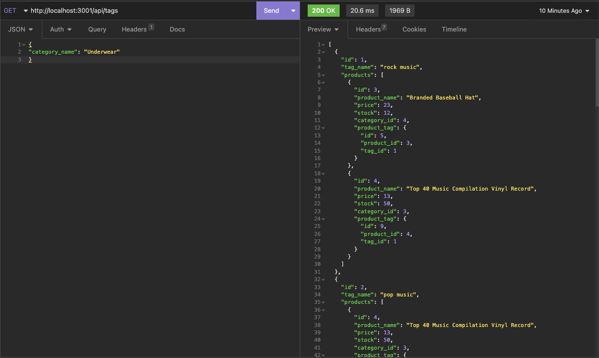

# E commerce-back-end
A back end for an e-commerce site.

## Description

A back end for an e-commerce site using an Express.js API to use Sequelize to interact with a MySQL database. Allows access via api routes to categories, products and tags. You can view all or by id, and add, update and delete as needed. It sets up databases for back end management of inventory, allowing for front end connectivity. It was a good project to learn and apply API routes, Express.js, Sequelize and mySQL database back end structure and implementation.

## Installation

Use node.js to run/connect the server. With connection established the routes can be tested and tables can be manipulated via mySQL and Insomnia/Postman.

## Usage

Once the server is connected to the local host, routes can be tested, and table data can be manipulated using Insomnia or Postman.
API Routes:
/api/categories
/api/products
/api/tags

Each of the above can be retrieved individually using the id: /api/categories/4

There are POST, PUT and DELETE routes for any of the 3 routes listed.

Screen shot shows Insomnia in use. See video for full demonstration of the back end.

Usage Video:

https://drive.google.com/file/d/1Ll9npI34WPbtll6W9isvLp2BO5PPNa4j/view

## Credits

N/A

## License

Please refer to the license in the Repo.